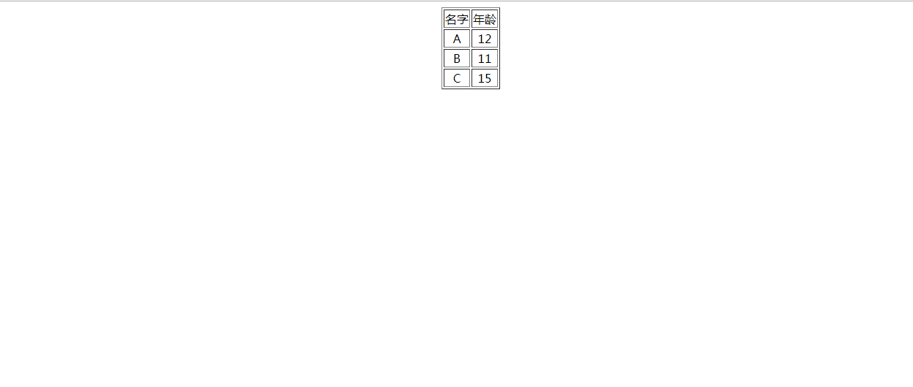

### 可变样式的表格边框

### 实例描述

为了突出显示网页中的数据,有时需要在鼠标移入这个数据时,将这个数据突出出来,表格数据就有这个功能

### 实例代码

```
<!DOCTYPE html>
<html lang="en">
<head>
	<meta charset="UTF-8">
	<title>可变样式的表格边框</title>
</head>
<body style="text-align:center">
	  <table id="tb1" align="center" border="1">
	  	<tr>
	  		<td>名字</td>
	  		<td>年龄</td>
	  	</tr>
	  	<tr>
	  		<td>A</td>
	  		<td>12</td>
	  	</tr>
	  	<tr>
	  		<td>B</td>
	  		<td>11</td>
	  	</tr>
	  	<tr>
	  		<td>C</td>
	  		<td>15</td>
	  	</tr>
	  </table>

	  <script>
	          var tb1= document.getElementById("tb1");

	  	      function chBorder(c){
	  	      	  tb1.style.border = "1px solid"+c;   // 动态的修改表格边边框框
	  	      }
	  	      tb1.onmouseover = function(){
	  	      	chBorder("#f00");
	  	      }
	  	      tb1.onmouseout = function(){
	  	      	chBorder("#abcdef");
	  	      }
	  </script>
</body>
</html>
```

### 运行的效果



### 具体分析

实现该效果主要是依托两个事件:onmouseover鼠标移入,onmouseout鼠标移出,他们分别对应鼠标的移入和移出,本例简单的修改了表格的边框颜色