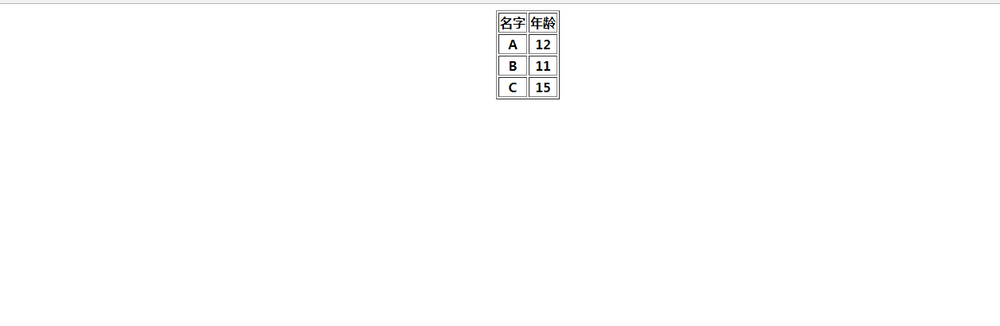

### 用背景色重点突出表格行

### 实例描述

当浏览表格数据的时候,有时候需要把刚刚浏览过的的某一行标记下来,那么就可以通过单击操作来把这一行的把背景色变深,以突出该表格行,这样就可以知道哪些表格行是用户记录下来的了

### 实现代码

```
<!DOCTYPE html>
<html lang="en">
<head>
	<meta charset="UTF-8">
	<title>用背景色重点突出表格行</title>
</head>
<body>
	   <table id="tb1" align="center" border="1">
	   	<tr>
	   		<th>名字</th>
	   		<th>年龄</th>
	   	</tr>
	   	<tr>
	   		<th>A</th>
	   		<th>12</th>
	   	</tr>
	   	<tr>
	   		<th>B</th>
	   		<th>11</th>
	   	</tr>
	   	<tr>
	   		<th>C</th>
	   		<th>15</th>
	   	</tr>
	   </table>

	   <script>
	           var oBody = document.getElementsByTagName("body")[0];
	           oBody.onload = function(){
	           	  chCell();
	           }
	   	       function chCell(){
	   	       	  var tb1 = document.getElementById("tb1");  // 为表格改变样式的函数
	   	       	  var rows = tb1.rows;   // 得到当前表格的row数组
	   	       	  var len = tb1.rows.length;  // 当前的行数
	   	       	  for(var i = 1;i<len;i++){  // 遍历所有行
                      var r = rows[i];     // 当前行
                      r.onclick = function(){  // 定义鼠标onclick事件
                          if(this.style.backgroundColor == "pink"){
                              this.style.backgroundColor = "white";
                          }else{
                          	 // 否则就让背景色变成粉红色
                          	 this.style.backgroundColor = "pink";
                          }
                      } 
	   	       	  }
	   	       }
	   </script>
</body>
</html>
```

### 实现效果



### 具体分析

首先遍历所有的表格行,然后为每个表格行指定onclick事件,当触发该事件时,就把这一行的背景色调深,同时把其他表格行的背景恢复为原有颜色

