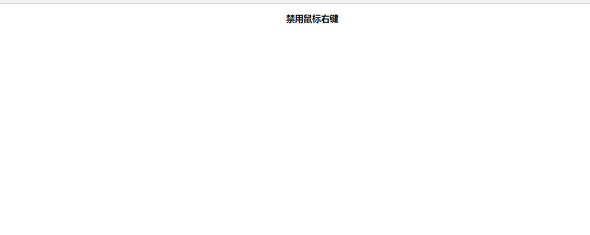

### 实例描述

有时,我们并不希望用户在网页中右击鼠标,因为不希望自己的写的代码被别人使用是不熬右键查看,此时,就可以通过禁用鼠标右键来防止这样的事情

### 实现代码

[禁用鼠标右键](禁用鼠标右键)

			       // 为文档的鼠标按下事件定义回调
			      document.onmousedown = function(event){
			      	 // 判断事件的值是否为鼠标右键
			      	 if(event.button == 2){
			      	 	alert("禁用鼠标右键!");
			      	 }
			      }
### 运行效果

### 难点剖析

对于鼠标按下事件来说,事件的button值包括鼠标左键,鼠标右键,中间简等,定义了鼠标按下可能的值及含义

* 0  |  没按键

* 1  | 按左键

* 2  | 按右键

* 3  | 按左键和右键

* 4  | 按中间键 

* 5  | 按左键和中间键

* 6  | 按右键和中间键

* 7  | 按所有键

* 如果只允许用户单击鼠标左键的话,则可以写如下的条件判断语句

* if(event.button) != 1

   