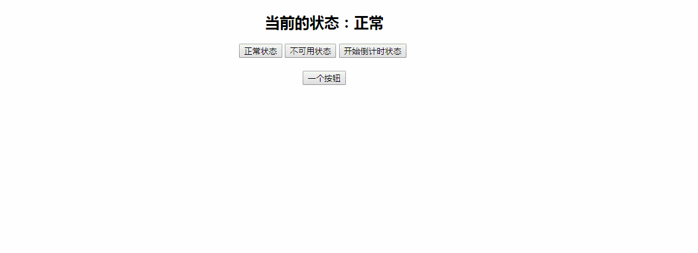

### 实例076 不同状态展示不同样式的按钮

### 实例描述

按钮的状态,这里指的是开发中会根据实际的情况把按钮设置为可用于否,什么时候可用状态,这些状态不是天然的,需要自己去调整和设置

### 实例代码如下
```
<!DOCTYPE html>
<html>
    <head>
        <title>不同的状态展示不同样式的按钮</title>
        <meta http-equiv="Content-Type" content="text/html; charset=UTF-8" />
        <script type="text/javascript">         
            var currStatus = '正常';          //当前的状态
            var myTimer = null;             //定时器
            var mySec = 0;                  //定时还剩下的秒
            //修改按钮为正常状态
            function normalStatus(){
                //获取到目标按钮的DOM
                var myBtn = document.getElementById('myBtn');
                myBtn.disabled = false;     //恢复可用状态
                window.clearInterval(myTimer);//取消定时器
                currStatus = '正常';          //设置正常状态显示值
                showStatus();               //显示当前状态
            }
            //修改按钮为不可用状态
            function disableStatus(){
                //获取到目标按钮的DOM
                var myBtn = document.getElementById('myBtn');
                myBtn.disabled = true;      //设置不可用为true
                window.clearInterval(myTimer);//取消定时器
                currStatus = '不可用';     //设置不可用状态显示值
                showStatus();               //显示当前状态
            }
            //修改按钮为开始定时10秒以后可用的状态
            function timerStatus(){
                //获取到目标按钮的DOM
                var myBtn = document.getElementById('myBtn');
                myBtn.disabled = true;      //设置不可用为true
                window.clearInterval(myTimer);//取消定时器
                mySec = 10;             //开始10秒倒计时
                myTimer = window.setInterval(function(){
                    if(mySec == 0){         //如果倒计时完了，则恢复按钮状态
                        normalStatus();     //恢复到正常状态
                    }else{
                        mySec--;            //让倒计时秒数自减
                        //设置倒计时状态显示值
                        currStatus = '倒计时中('+mySec+')';
                        showStatus();       //显示当前状态
                    }
                }, 1000);
            }
            //显示当前状态
            function showStatus(){
                //获取到标题的DOM
                var h2 = document.getElementsByTagName("h2")[0];
                //设置标题为当前的状态
                h2.innerHTML = '当前的状态：' + currStatus; 
            }
        </script>
    </head>
    <body style="text-align:center;">
        <!-- 定义按钮 -->
        <h2>当前的状态：</h2>
        <input type="button" value="正常状态" id="myBtn1" onclick="normalStatus()"/>
        <input type="button" value="不可用状态" id="myBtn2" onclick="disableStatus()"/>
        <input type="button" value="开始倒计时状态" id="myBtn3" onclick="timerStatus()"/>
        <br /><br />
        <input type="button" value="一个按钮" id="myBtn"/>
    </body>
</html>
```
### 运行效果


### 具体分析

本例体现了3种按钮状态,正常,不可用和倒计时可用,其中正常就是普通的按钮状态,不可用的按钮值的是按钮的disabled属性设置为true，按钮呈现一种灰色不可单击的状态，最后一种倒计时可用的状态,就要借助定时器的功能了,实例代码中用mySec变量记录了当前倒计时还剩下的秒数,然后用myTimer来记录定时变量,当需要恢复按钮正常状态时,则停止定时器

