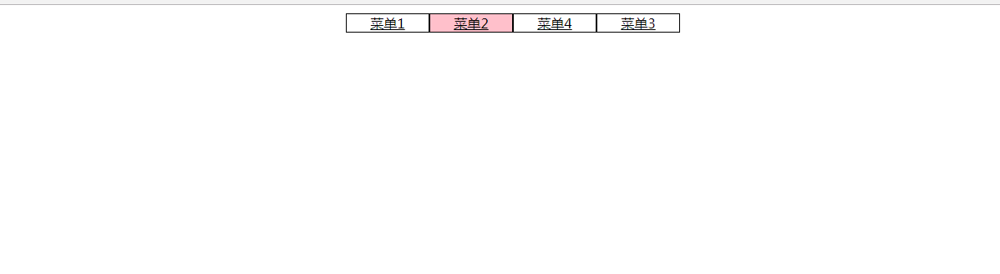

### 凸显正在浏览的菜单项的导航菜单

### 实例描述

用户在浏览网页时,程序把该正在浏览的目录菜单项增加一个凸显的样式,用户就会很直观的知道自己在网站中浏览的位置

### 实例代码

```
<!DOCTYPE html>
<html lang="en">

<head>
    <meta charset="UTF-8">
    <title>凸顯正在瀏覽的菜單項的導航菜單</title>
    <style>
    .menu {
        list-style: none;
        width: 400px;
        margin: 10px auto;
    }

    .menu li {
        float: left;
        width: 98px;
        border: 1px solid #000;
    }

    .menu a {
        color: #000;
        width: 100%;
        display: inline-block;
    }

    .menu a:hover {
        background-color: #f00;
    }

    .curr {
        background-color: pink;
    }
    </style>
</head>
<body style="text-align:center;" onload="init()">
    <ul class="menu" id="menu">
        <li><a href="#">菜单1</a></li>
        <li><a href="#">菜单2</a></li>
        <li><a href="#">菜单4</a></li>
        <li><a href="#">菜单3</a></li>
    </ul>
    <script>
    var currIndex = 1; // 正在瀏覽的菜單項下標
    function init() { // 網頁加載完成事件函數
        // 得到菜單DOM
        var menu = document.getElementById("menu");
        // 遍歷所有的菜單項
        var items = menu.children;
        for (var i = 0; i < items.length; i++) {
            var item = items[i]; // 得到當前的菜單項
            // 如果遍歷到正在瀏覽的菜單項,就添加樣式
            if (i == currIndex) {
                item.className = 'curr';
            }
        }
    }
    </script>
</body>

</html>
```

### 运行效果



### 具体分析

首先代码定义了一个currIndex变量,它的值一般由服务器端决定,然后遍历所有的菜单项,当下标与currIndex一致时,就可以把当前的那个菜单项加上预定义号的css样式

