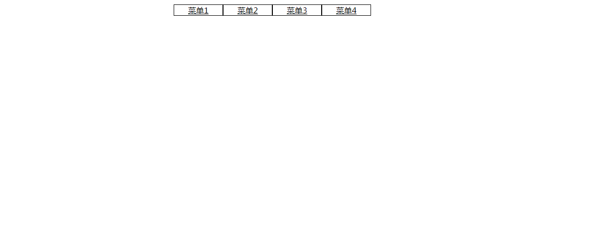

### 三级导航菜单

### 实例描述

一般来说,导航的菜单最多只能到第三层,否则就不具有可读性了

### 实现代码

```
<!DOCTYPE html>
<html>
	<head>
		<title>三级导航菜单</title>
		<meta http-equiv="Content-Type" content="text/html; charset=UTF-8"/>
			
		<style>
			.menu{
				list-style: none;
				width: 500px;
				margin: 10px auto 0;
				padding:0;
			}
			.menu li{
				float:left;
				width:98px;
				border:1px solid black;
			}
			.menu a{
				color:black;
				width:100%;
				display:inline-block;
			}
			.menu a:hover{
				background-color:pink;
			}
			.clearfix:after {
				visibility: hidden;
				display: block;
				font-size: 0;
				content: " ";
				clear: both;
				height: 0;
			}
			.sub_menu{
				border:1px solid black;
				width: 100px;
				padding:0;
				display: none;
				margin:0;
				float:left;
			}
			.sub_div{
				width: 505px;
				margin: 0 auto;
			}
			.third_menu{
				display:none;
				float: left;
				border:1px solid black;
				width: 100px;
				padding:0;
				margin:0;
			}
		</style>
	</head>
	<body style="text-align:center">
		<ul class="menu clearfix">
			<li><a href="#">菜单1</a></li>
			<li><a href="#">菜单2</a></li>
			<li><a href="#">菜单3</a></li>
			<li><a href="#">菜单4</a></li>
		</ul>
		<div class="sub_div clearfix">
			<ul class="sub_menu">
				<li><a href="#" class="sub sub_1" index="0">菜单1</a></li>
			</ul>
			<ul class="third_menu" id="sub_1">
				<li><a href="#">菜单1-1</a></li>
				<li><a href="#">菜单1-2</a></li>
			</ul>
			<ul class="sub_menu">
				<li><a href="#">菜单2-1</a></li>
				<li><a href="#">菜单2-2</a></li>
			</ul>
			<ul class="sub_menu">
				<li><a href="#">菜单3-1</a></li>
			</ul>
			<ul class="sub_menu">
				<li><a href="#">菜单4-1</a></li>
				<li><a href="#" class="sub sub_2" index="1">菜单4-2</a></li>
				<li><a href="#">菜单4-3</a></li>
			</ul>
			<ul class="third_menu" id="sub_2">
				<li><a href="#">菜单4-2-1</a></li>
				<li><a href="#">菜单4-3-1</a></li>
			</ul>
		</div>
		<script src="jquery.js"></script>
		<script type="text/javascript">
			//使用jquery的加载回调函数开始定义菜单的功能
			$(function(){
				var menus = $('.menu a');		//得到菜单下所有的链接
				for(var i=0;i<menus.length;i++){//遍历这些链接
					var m = menus[i];			//得到当前的链接
					$(m).mouseover(function(){	//为菜单链接定义onmouover事件
						//得到当前鼠标移入的菜单项的下标
						var index = $('.menu a').index(this);
						$('.sub_menu').hide();	//把其他二级菜单隐藏
						$('.third_menu').hide();//三级也隐藏
						$('.sub_menu').eq(index).show();//显示对应的二级菜单
						//计算二级菜单应该定位的位置
						$('.sub_menu').eq(index).css('margin-left',(100*index)+'px');
					});
				}
				//为包含第三级菜单的二级菜单定义onmouseover事件
				$('.sub').mouseover(function(){
					//得到它的class属性
					var className = $(this).attr('class');
					//得到第三级菜单的id值
					var subId = className.split(' ')[1];
					$('#'+subId).show();		//显示第三级菜单
					var index = $(this).attr('index');//得到它的下标
					//计算第三级菜单显示的坐标位置
					$('#'+subId).css('margin-top',(parseInt(index)*20)+'px');
				});
			});
		</script>
	</body>
</html>
```

### 实现效果



### 具体分析

三级菜单不能像二级菜单那么处理,尤其是对于三级菜单单向的DOM 定义,如果包含了三级菜单的二级菜单,会多出一个class属性的subb,并且还有一个sub-x的class属性,通过他定义了它对应的第三级菜单的id值,这样就方便了带有sub属性的二级菜单项定义onmouseover事件时,找到对应的三级菜单项的DOM