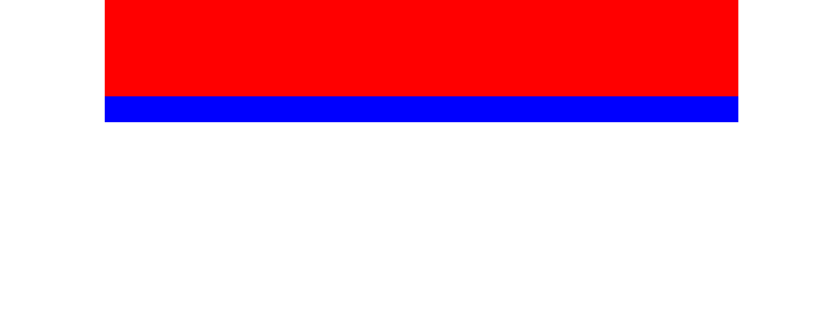

### 当网页超过一屏时导航菜单始终置顶

### 实例描述

在一些电子商务网站的商品详情介绍页面里,通常会有一个导航菜单始终跟随页面,无论页面滚动到中间还是底部,这是为了方便用户查看商品的各类信息或者提交订单购物

### 实例代码

```
<!DOCTYPE html>
<html lang="en">
<head>
	<meta charset="UTF-8">
	<title>当网页超过一屏时导航菜单始终置顶</title>
	<style>
		  *{
		  	padding: 0;
		  	margin: 0;
		  }
		  .wrap{
		  	  width: 100%;
		  }
		  .hd{
		  	width: 980px;
		  	height: 150px;
		  	margin: 0 auto;
		  	background-color: #f00;
		  }
		  .the-top{
		  	position: fixed;
		  	width: 100%; 
		  }
		  .the-top .hd{
		  	display: none;
		  }
	</style>
</head>
<body style="text-align:center" onload="init()">
	  <div id="wrap" class="wrap">
	  	    <div class="hd"></div>
	  	    <div class="hd"></div>
	  </div>
	  <br>
	  <br>
	  <br>
	  <br>
	  <br>
	  <br>
	  <br>
	  <br>
	  <br>
	  <br>
	  <br>
	  <br>
	  <br>
	  <br>
	  <br>
	  <br>
	  <br>
	  <br>
	  <br>
	  <br>
	  <br>
	  <br>
	  <br>
	  <br>
	  <br>
	  <br>
	  <br>
	  <br>
	  <br>
	  <br>
	  <br>
	  <br>
	  <br>
	  <br>
	  <br>
	  <br>
	  <br>
	  <br>
	  <br>
	  <br>
	  <br>
	  <br>
	  <br>
	  <br>
	  <br>
	  <br>
	  <br>
	  <br>
	  <br>
	  <br>
	  <br>
	  <br>
	  <br>
	  <br>
	  <br>
	  <br>
	  <br>
	  <br>
	  <br>
	  <br>
	  <br>
	  <br>
	  <br>
	  <br>
	  <br>
	  <br>
	  <br>
	  <br>
	  <br>
	  <br>
	  <br>
	  <br>
	  <br>
	  <br>
	  <br>
	  <br>
	  <br>
	  <br>
	  <br>
	  <br>
	  <br>
	  <br>
	  <br>
	  <br>
	  <br>
	  <br>
	  <br>
	  <br>
	  <br>
	  <br>
	  <br>
	  <br>
	  <br>
	  <br>
	  <br>
	  <br>
	  <br>
	  <br>
	  <br>
	  <br>

	  <script>
	  	       // 初始化函数
	  	       function init(){
	  	       	   // 获取顶部元素的DOM
	  	       	   var wrap = document.getElementById("wrap");
	  	       	   var scrollTop = 0;  // 初始化为顶部
	  	       	   // 监听页面滚动事件
	  	       	   window.onscroll = function(){
                      // 获取当前的滚动距离
                      scrollTop = document.body.scrollTop || document.documentElement.scrollTop;
                      // 超过150像素的滚动,就把导航菜单DIV设置为固定
                      if(scrollTop > 150){
                        wrap.className = "the-top"; // 固定下来的样式
                      }else{
                      	wrap.className = "wrap";    // 恢复原来的样式
                      }
	  	       	   }  

	  	       }
	  </script>
</body>
</html>
```

## 运行效果



### 具体分析

首先,要想让一个层始终固定在屏幕的顶部或者底部,就不得不使用css的position样式,其次,在来控制王爷是不是需要把导航菜单置顶的,因为当网页内容的浏览还没有滑出导航菜单的可见范围时,是没有必要把导航菜单置顶的,因此代码就需要监听网页的滚动条滑动事件,当超出一定的范围以后,才有必要为导航菜单设置固定的position样式

