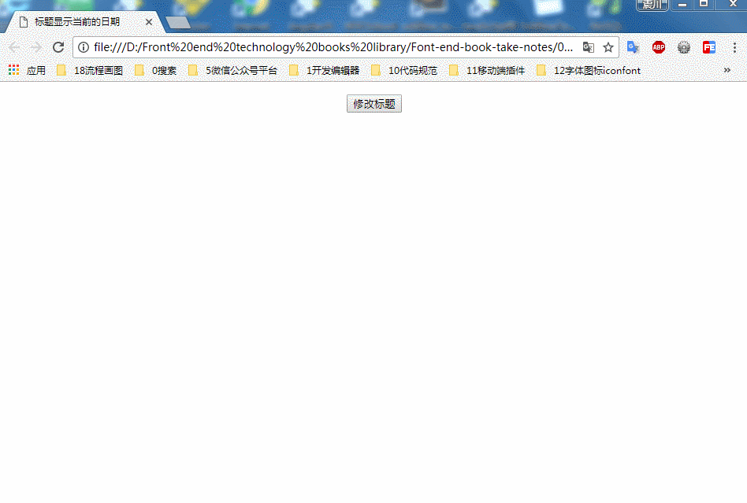

### 标题栏显示当前的日期
### 实例描述
标题栏是网页的标题,它的值允许动态的修改,所以可以把网页标题改为当前的时间
### 实现代码
```
<!DOCTYPE html>
<html lang="en">
<head>
    <meta charset="UTF-8">
    <meta name="viewport" content="width=device-width, user-scalable=no, initial-scale=1.0, maximum-scale=1.0, minimum-scale=1.0">
    <!--[if IE]>
    <![endif]-->
    <!--[if !IE]><!-->
    <!--<![endif]-->
    <meta http-equiv="Content-Type" content="text/html;charset=UTF-8">      
    <title>标题显示当前的日期</title>
</head>
<body style="text-align: center;" id="body">
      <p><input type="button" value="修改标题" onclick="start()"></p>

      <script>
          // 修改标题的函数
          function start(){
             var data = new Date();   // 得到当前的时间
             document.title = data.toString(); // 把事件字符形式展示在网页的标题上
             document.getElementsByTagName("body")[0].innerHTML +=  document.title;
          }
      </script>
</body>
</html>

```

### 运行效果


### 具体分析

首先要得到当前的时间,办法就是新建一个Date对象,然后,通过document.title属性把标题栏的信息改为当前的时间

### 其他说明

默认的事件都是一个标准的时间显示的字符,如果想要更符合国人的时间格式,可以通过手动拼接来实现