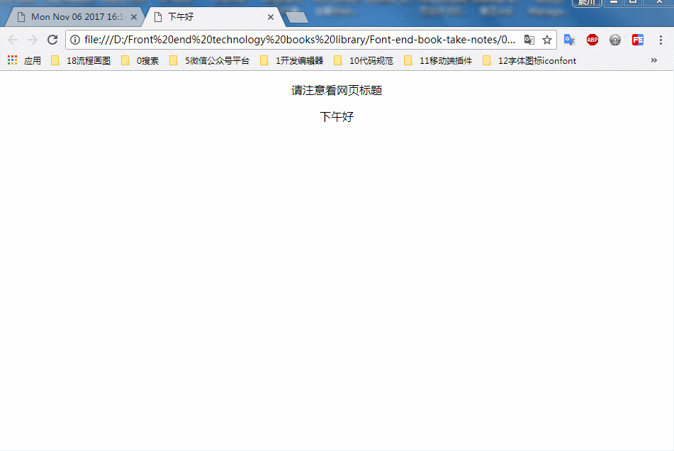

###不同时段显示不同的标题欢迎词

### 实例描述

不同时段显示不同的欢迎词,会给用户一种比较友好的感觉,要实现该效果难点就是短短时段

### 实现代码

```
<!DOCTYPE html>
<html lang="en">
<head>
    <meta charset="UTF-8">
    <title>不同时间段显示不同的标题欢迎词</title>
</head>
<body style="text-align:center">
      <p>
          请注意看网页标题
      </p>

      <script>
              var oBody = document.getElementsByTagName("body")[0];
              oBody.onload = function(){
                start();
              }
              // 修改标题函数
              function start(){
                 var date = new Date();   // 当前的时间
                 var str = "";   // 定义拼接字符变量
                 var hour = date.getHours();  // 得到小时数
                 if(hour < 12){     // 如果小于12则是早上
                    str = "早上好";
                 }
                 if(hour>=12 && hour<18){  // 否则,就是晚上
                     str = '下午好';
                 }
                 if(hour >=18){
                     str = "晚上好";
                 }
                 document.title = str;   // 修改网页的标题
                 oBody.innerHTML += document.title;
              }
      </script>
</body>
</html>
```

### 运行效果



### 具体分析

通过Date对象的getHours()函数,可以知道当前24小时的小时数,当小时数字0与12之间时,默认是早晨,在12-18之间,则为下午,在18-24之间就是晚上

