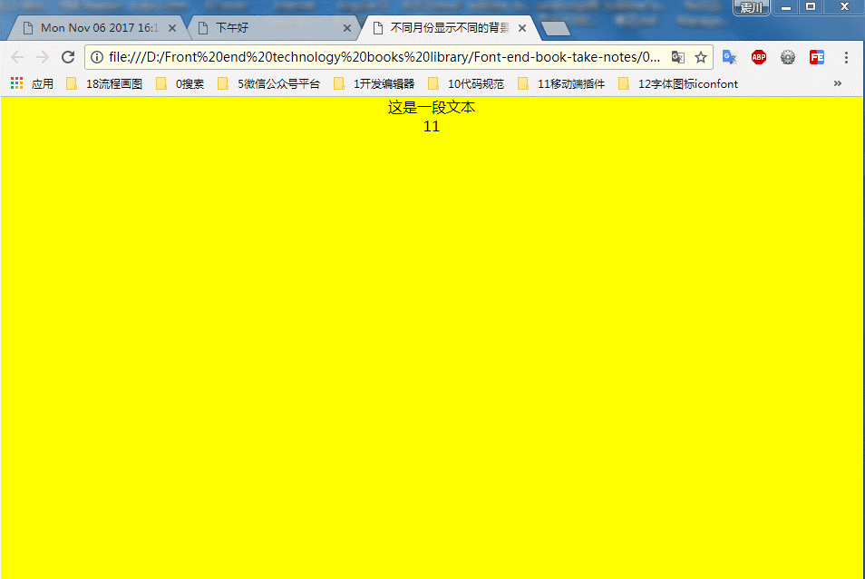

### 不同的月份显示不同的背景效果

### 实例描述
如果用户经常访问你的网站,而你每个月都会变化一下网页的背景,使网页变得多姿多彩,则会让用户很期待,也可以给用户一种不枯燥的感觉

### 实现代码

```
<!DOCTYPE html>
<html lang="en">
<head>
    <meta charset="UTF-8">
    <meta name="viewport" content="width=device-width, user-scalable=no, initial-scale=1.0, maximum-scale=1.0, minimum-scale=1.0">
    <title>不同月份显示不同的背景效果</title>
    <style>
        *{
            padding: 0;
            margin: 0;
        }
        body{
            text-align: center;
        }
    </style>
</head>
<body>
      <p>这是一段文本</p>

      <script>
             var oBody = document.getElementsByTagName("body")[0];
             oBody.onload = function(){
                chColor();
             }
             function chColor(){  // 开始判断月份的函数
                var date = new Date();  // 得到当前的时间
                var m = date.getMonth()+1; // 得到月份数
                if(m%2 == 0){
                    // 如果是偶数,则为蓝色
                    document.body.style.backgroundColor = "blue";
                }else{
                    document.body.style.backgroundColor = "yellow"
                    oBody.innerHTML += m;
                }
             }
      </script>
</body>
</html>

```
### 运行效果



### 具体分析
 本示例只是修改了网页的背景色,其实,在一些比较高级的网站里,用户还会看到背景图片,比如根据春夏秋冬四季,每个月提供一副不同的背景图片,这样会给用户更好的感觉