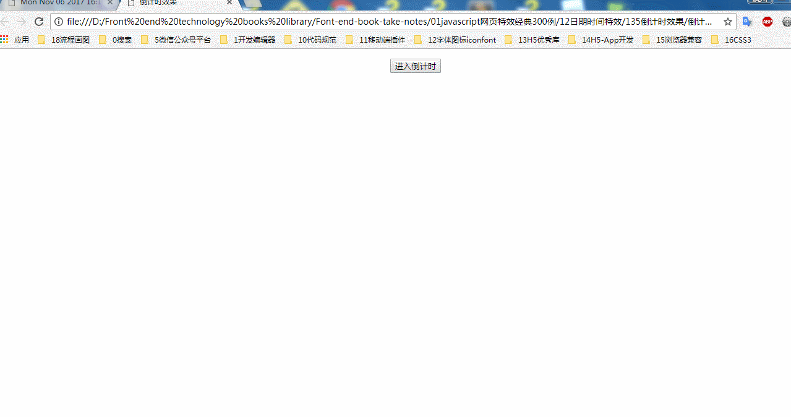

### 倒计时效果
### 实例描述
在一些重大节日或盛会到来之前,比如奥林匹克运动会,圣诞节,元旦等,人们都有倒计时的习惯

### 实现代码

```
<!DOCTYPE html>
<html>
    <head>
        <title>倒计时效果</title>
        <meta http-equiv="Content-Type" content="text/html; charset=UTF-8"/>
            
    </head>
    <body style="text-align:center">
        <p>         
            <input type="button" value="进入倒计时" onclick="start();"/>
        </p>
        <h2 id="left"></h2> 

        <script type="text/javascript">     
            function start(){               
                setInterval(function(){
                    var now = new Date();
                    var end = new Date(now.getYear() + 1 + 1900,0,1);
                    var time = end.getTime() - now.getTime();
                    var str = getTimeTxt(time);
                    document.getElementById('left').innerHTML = '距离明年年元旦还剩:' + str;
                },1000);                
            }
            function getTimeTxt(time){
                time /= 1000;
                var days = time / (24*60*60);
                var hour = time % (24*60*60) / (60*60);
                var min = time % (24*60*60) % (60*60) / 60;
                var sec = time % (24*60*60) % (60*60) % 60;
                var str = '';
                if(days > 0)
                    str += Math.floor(days)+'天';
                if(hour > 0)
                    str +=  Math.floor(hour)+'时';
                if(min > 0)
                    str +=  Math.floor(min)+'分';
                str +=  Math.floor(sec)+'秒';
                return str;
            }
        </script>
    </body>
</html> 

```
### 运行效果


### 具体分析

本例中主要有两个地方需要注意
1. 得到距离时间的毫秒数,本例通过事件戳的相减获得
2. 剩余时间的表示形式,如何计算精确的天数,小时数,分钟数和秒数,这些是通过一系列的相除和取余来实现的,如实例代码getTIimeTxt()函数


