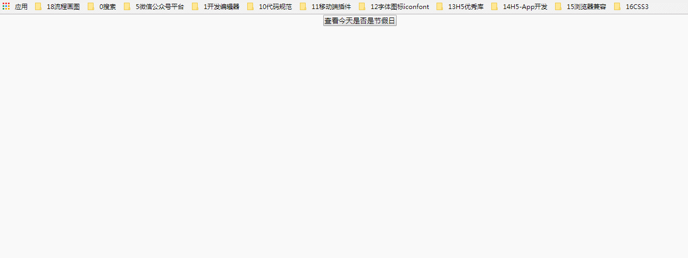

### 查看今天是否为节假日

### 实例描述
既然javascript有一套完整的日期和时间函数,那么是否能在打开网页时就知道今天是否为周末或节假日?

### 实现代码

```
<!DOCTYPE html>
<html lang="en">
<head>
    <meta charset="UTF-8">
    <title>查看今天是否为节假日</title>
    <style>
        *{
            padding: 0;
            margin: 0;
         }
         body{
            text-align: center;
         }
    </style>
</head>
<body>
      <p>
          <input type="button" value="查看今天是否是节假日" onclick="start()">
      </p>
      <h2 id="left"></h2>

      <script>
              function start(){  // 开始函数
                 setInterval(function(){  // 开始定时器函数
                      var now = new Date();   // 当前的时间
                      var m = now.getMonth()+1;  // 月份
                      var d = now.getDate();  // 日
                      var str = "";
                      str += now.getYear()+1900+'年';  // 年
                      str += now.getMonth()+1+'月';
                      str += now.getDate()+"日";
                      str += now.getMinutes()+'分';
                      str += now.getSeconds()+'秒'; // 秒
                      if(now.getDay()>=5){
                          str += ',今天是周末';
                      }else if(m == 1 && d==1){
                          str += ',今天是劳动节';
                      }else if(m == 10 && d==1){
                          str += ',今天是国庆节'  // 今天不是节假日
                      }else{
                          str += ',今天不是节假日'
                      }
                        // 打印结果
                       document.getElementById("left").innerHTML = str;

                 },1000)
              }
      </script>
</body>
</html>

```
### 实例运行效果


### 具体分析

首先本例
通过Data对象的一系列属性,得到了今天所在的月份,日,周,小时,分钟和秒,然后通过这些数据就可以判断,本例只判断了周末,元旦,劳动节,国庆节