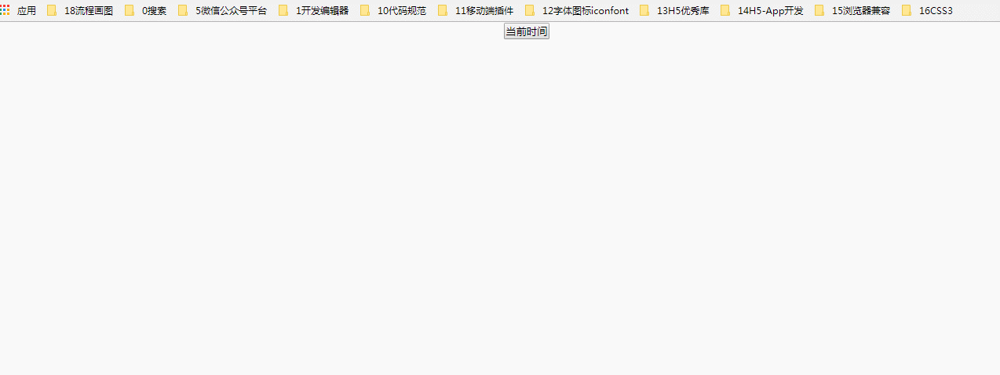

### 每秒刷新的时间展示效果

### 实例描述
在网页中显示当前的时间,时间一般都是固定的,不会随着手表的秒针转动而转动,必须刷新网页后,这个时间才会变动,要在网页中显示一个变化的时钟,必须每隔一秒就刷新一次网页

### 实现代码
```
<!DOCTYPE html>
<html lang="en">
<head>
    <meta charset="UTF-8">
    <title>每秒刷新的时间展示效果</title>
    <style>
          *{
            padding: 0;
            margin: 0;
          }
          body{
            text-align: center;
          }
    </style>
</head>
<body>
      <p><input type="button" value="当前时间" onclick="start()"></p>
       <h2 id="left"></h2>
      <script>
            function start(){  // 开始函数
                setInterval(function(){
                    var now = new Date();  // 当前时间
                    var str = "";
                    str += now.getYear()+1900+'年';   // 年
                    str += now.getMonth()+1+'月'; // 月
                    str += now.getDate()+'日';   // 日
                    str += now.getHours()+'时';  // 时
                    str += now.getMinutes()+'分'; // 分
                    str += now.getSeconds()+'秒'; // 秒
                    document.getElementById('left').innerHTML= str;
                },1000)
            }
      </script>
</body>
</html>
```
### 运行效果


### 具体分析

示例中主要是依赖一个定时器,该定时器的时间间隔只能为1秒,只有这样才能模拟出时钟的效果
