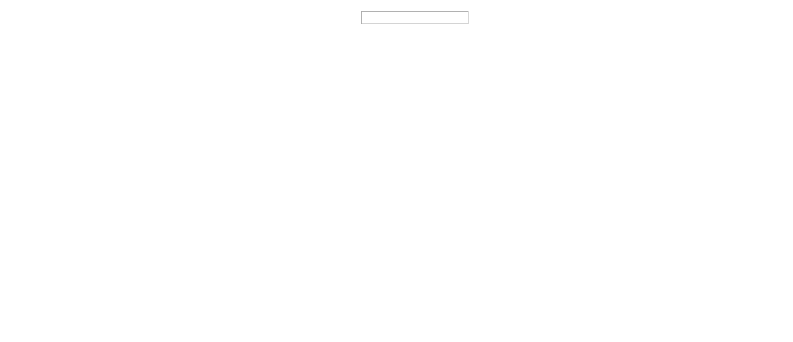

### 日期输入框

### 实例描述

在一些成熟的商业控件中,有一种日期输入框可以通过可视化的方式让用户选择一个日期,而这个显示日期的形式就好像一个非常直观的日历,本例将演示如何实现该特效

### 实现代码
```
<!DOCTYPE html>
<html>
    <head>
        <title>日期输入框</title>
        <meta http-equiv="Content-Type" content="text/html; charset=UTF-8"/>
        <style>
             body{
                text-align: center;
             }
             #d_div{
                border: 1px solid red;
                display: none;
                width: 400px;
                margin: 0 auto;
                padding: 5px;
             }
        </style>
    </head>
    <body style="text-align:center" onload="init();">
        <!-- 输入框开始 -->
        <p>
            <input type="text" onfocus="inputDate(this)"/>
        </p>
        <!-- 输入框结束 -->
        <!-- 表格开始  -->
        <div id="d_div">
            <p>
                <select id="y"></select>年
                <select id="m" onchange="showDetail()"></select>月
            </p>
            <table id="tbl" border="1" align="center"></table>
        </div>
        <!-- 表格结束 -->
        <script type="text/javascript"> 
            // 初始化函数    
            function init(){
                var y = document.getElementById('y');  // 获取元素年份的DOM
                var m = document.getElementById('m');  // 获取月份元素的DOM
                var str = '';                          // 定义空的字符串,拼接字符串
                for(var i=2000;i<2030;i++){            // 为年份的下拉菜单指定可选项
                    str += '<option value="'+i+'">'+i+'</option>';
                }
                y.innerHTML = str;                     // 动态指定下拉菜单的内容
                str = '';                              // 恢复空白字符串
                for(var i=1;i<=12;i++){                // 12个月,填充月份
                    str += '<option value="'+i+'">'+i+'</option>'; 
                }
                m.innerHTML = str;                      // 填充月份的DOM
            }
            // 展示表格,展示细节的输入框
            function showDetail(){
                var year = document.getElementById('y').value; // 选择年
                year = parseInt(year);                         // 解析为数字型变量
                var month = parseInt(document.getElementById('m').value); // 获取月份值
                var days = 30;                                 // 默认为30天
                if(isRunNian(year)&&month==2){                 // 如果闰年是2月份，一共是29天
                    days = 29;
                }else if(!isRunNian(year)&&month==2){ // 如果不是闰年的2月,一共28天
                    days = 28;
                }else if(month == 1
                    ||month == 3
                    ||month == 5
                    ||month == 7
                    ||month == 8
                    ||month == 10
                    ||month == 12){
                    days = 31;                 // 其他月为31天
                }                   
                var str = '<tr>';              // 开始拼接日子的表头,为星期
                for(var i=1;i<=7;i++){         // 从星期一到星期日
                    str += '<td>星期'+i+'</td>';  // 显示星期几
                }
                str += '</tr>';                  // 完成星期字符
                
                var date = new Date(year,month-1,1);  // 创建指定年月日的日期
                var week = date.getDay();        // 它对应的星期几
                var j = 1;                       // 定义j的变量
                while(true){                     // 永真循环
                    str += '<tr>';               // 拼接字符串
                    for(var i=1;i<=7;i++){       // 循环7次
                        if(j == 1 && i==week){   // 如果星期对上了,则开始打印1号
                            str += '<td onclick="fillDay('+j+');">1</td>';
                            j++;
                        }else if(j > 1 && j<=days){  // 如果对上以后,则打印1号以后的
                            str += '<td onclick="fillDay('+j+');">'+j+'</td>';
                            j++;
                        }else                        // 否则就打印一个子单元格
                            str += '<td>&nbsp;</td>';
                    }
                    str += '</tr>';
                    if(j >= days)                 // 如果j超过了当月的最大天数,则退出
                        break;
                }
                document.getElementById('tbl').innerHTML = str; // 填充输入区域
            }
            // 判断是否为润年
            function isRunNian(y){
                return y % 4 ==0;
            }
            // 一整天
            function fillDay(d){  // 填充日期的值
                var y = document.getElementById('y').value;  // 获取这个年的值
                var m = document.getElementById('m').value;  // 获取这个月的值
                window.currDateInput.value = y+'年'+m+'月'+d+'日';  // 年月日
            }
            // 输入时间
            function inputDate(input){                 // 日期输入框的onfocus事件
                window.currDateInput = input;          // 设置当前的日期输入框
                // 获取到它的DOM
                var d = document.getElementById('d_div');               
                var y = document.getElementById('y');
                var m = document.getElementById('m');
                var now = new Date();                     // 当前的日期
                y.value = now.getFullYear();
                m.value = now.getMonth() + 1;           // 年份
                d.style.display = 'block';             // 月份
                showDetail();                          // 为日历填充数据
            }
        </script>   
    </body>
</html>
```
### 运行效果

### 具体分析
示例中主要难点就是如何控制这个输入区域是否显示,以及单击某个日历单元格时日期的自动填充,首先,当日期输入框获取焦点后,就需要显示这个隐藏的日历区域,然后为每个单元格指定click事件,当触发该事件时,把日期拼接好,并赋值给当前的日期输入框
