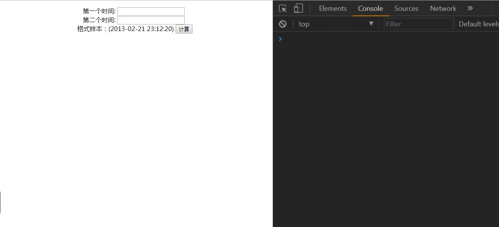

### 算出两个时间之间的时间差

### 实例描述

两个时间总是存在时间差的,这个时间应该如何计算呢,如果使用年月日的减法操作,会涉及闰年等情况,显得比较麻烦,本例将演示快捷的计算两个时间的时间差

### 实现代码
```
<!DOCTYPE html>
<html>

<head>
    <title>算出两个时间之间的时间差</title>
    <meta http-equiv="Content-Type" content="text/html; charset=UTF-8" />
</head>

<body style="text-align:center">
    <p>
        <label>第一个时间:</label>
        <input type="text" name="time1" id="time1" />
        <br>
        <label>第二个时间:</label>
        <input type="text" name="time2" id="time2" />
        <br>
        <label>格式样本：(2013-02-21 23:12:20)</label>
        <input type="button" value="计算" onclick="start();" />
    </p>
    <script type="text/javascript">
    //计算时差的函数
    function start() {    // 计算时间差的函数
        var time1 = document.getElementById('time1').value;  // 第一个时间
        var time2 = document.getElementById('time2').value;  // 第二个时间
        var t1 = parseTime(time1);                           // 解析第一个时间字符
        var t2 = parseTime(time2);                           // 解析第二个时间字符
        var span = t1.getTime() - t2.getTime();              // 把得到的毫秒数相减
        span = Math.abs(span / 1000);                        // 取绝对值,并去掉毫秒单位
        console.log('两个时间相差' + span + '秒');                 // 显示他们相差的毫秒数
    }

    function parseTime(str) {                               // 解析时间的字符
        var date = str.split(' ')[0];                       // 得到日期和时间的分割
        var darr = date.split('-');                         // 得到日期的分开信息
        var time = str.split(' ')[1];                       // 得到时间的数组
        var tarr = time.split(':');                         // 得到时间的分开信息
        var y = parseInt(darr[0]);                          // 年
        var m = parseInt(darr[1]);                          // 月
        var d = parseInt(darr[2]);                          // 日
        var h = parseInt(tarr[0]);                          // 小时
        var mm = parseInt(tarr[1]);                         // 分钟
        var s = parseInt(tarr[2]);                          // 秒
        return new Date(y, m, d, h, mm, s);                 // 重新创建日期对象并返回
    }
    </script>
</body>

</html>
```
### 实现运行效果

### 具体分析
时间的本质就是一个整型数据类型,它存储的核心为一个毫秒数,因此,不必管两个时间之间是否存在闰年的2月等信息,只需要进行相减的毫秒数秒,那么相差的天数,小时数,分钟数等信息也就一目了然
