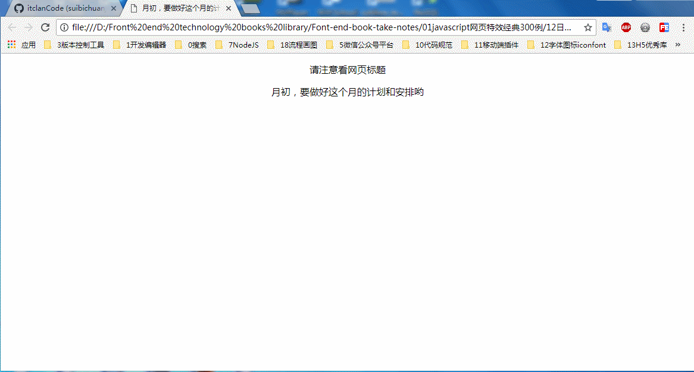

### 月底和月初的网页标题各不相同

### 实例描述
对于一些银行或者电信运营商的网站,月底和月初非常的重要,因为对他们的客户来说,网站必须具备提醒的功能,比如提醒用户记得充值,还款等信

### 实现代码
```
<!DOCTYPE html>
<html>
    <head>
        <title>月底和月初的网页标题各不相同</title>
        <meta http-equiv="Content-Type" content="text/html; charset=UTF-8"/>
        <style>
              body{
                text-align: center;
              }
        </style>
    </head>
    <body  onload="start()">
        <p>
            请注意看网页标题
        </p>

        <script type="text/javascript">     
            //修改标题的函数
            function start(){   
                var date = new Date();
                var str = '';
                var m = date.getMonth();
                if(m < 15)
                    str = '月初，要做好这个月的计划和安排哟';
                if(m >= 15)
                    str = '这个月已经过去超过一半了，请珍惜时间';
                document.title = str;
                document.getElementsByTagName("body")[0].innerHTML += str;
            }
        </script>   
    </body>
</html>
```
### 运行效果

### 具体分析
每个系统对于月末和月初的理解不一样,本例就认为小于15号表示月初,否则表示月末