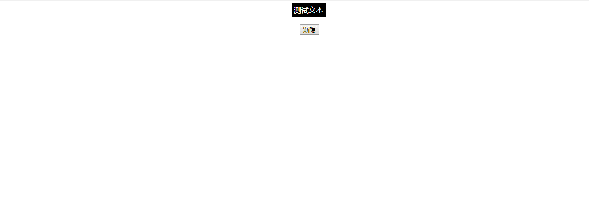

### 动态滤镜的效果
### 实例描述
滤镜是光学上的一种常用的镜片,它的作用很多,其中比较常见的就是让物体变得若隐若现，网页和javascript也提供了类似滤镜的特效

### 实例代码
```
<!DOCTYPE html>
<html lang="en">
<head>
    <meta charset="UTF-8">
    <title>动态滤镜的效果</title>
    <style>
         .myclass{
            color:white;
            background-color: #000;
            padding: 5px;
         }
    </style>
</head>
<body style="text-align:center">
        <span id="mytxt" class="myclass">测试文本</span>
        <br>
        <br>
        <input type="button" value="渐隐" onclick="timeHide()">
        <script>
               var timer = null;
               // 按钮的click事件监听函数
               function timeHide(){
                   // 获取目标DOM
                   var myTxt = document.getElementById("mytxt");
                   if(mytxt.style.opacity == ''){  // 如果目标的opacity属性为默认
                      mytxt.style.opacity = 1;   // 则设置为1,表示完全相同
                      timer = setInterval(function(){ // 开始一个timer定时器
                         if(mytxt.style.opacity>0){ // 如果大于0,则一直自减1
                             // 每次少0.1的透明度
                             mytxt.style.opacity = mytxt.style.opacity-0.1;
                         }
                         if(mytxt.style.opacity == 0){ // 当完全隐藏以后,则取消定时器
                            window.clearInterval(timer);  // 取消定时器
                          }
                      },200)                              //定时器间隔为200毫秒
                   }

               }                
        </script>
</body>
</html>
```
### 运行效果

### 具体分析
网页元素的样式属性opacity用来控制元素的透明度,它的值从0到1,表示越来越清晰,因此,z在实例代码中,当用户单击渐隐按钮时,程序通过逐步减少opacity值的办法,来实现文本文字的可见度越来越低的效果