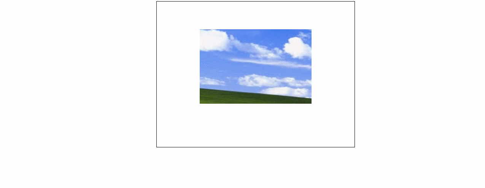

### 让图片保持在曾丽的上下左右都居中
### 实例描述
经常浏览网路相册的读者会知道,可以为照片指定相框,而这些照片始终显示在相框的中间,也就是上下左右都居中
### 实现代码
```
<!DOCTYPE html>
<html lang="en">
<head>
    <meta charset="UTF-8">
    <title>让图片保持在层里的上下左右都居中</title>
    <style>
          div{
            width: 500px;
            height: 300px;
            border: 1px solid #000;
            margin: 10px auto;
            padding: 10px;
          } 
    </style>
</head>
<body style="text-align:center" onload="init()">
       <div></div>

       <script>
               function init(){     // 初始化函数
                  var　img = document.getElementById("the-img");  // 获取图片的DOM
                  var width = img.width;   // 图片的宽度
                  var height = img.height; // 图片的高度
                  var div = img.parentNode;  // 相框div的dom
                  var w = div.offsetWidth;   // 相框的实际宽度
                  var h = div.offsetHeight;  // 相框的实际高度
                  img.style.margin = '0 auto'; // 通过margin的auto设置左右居中
                  var padding = (h-height)/2;  // 计算图片的高度差的一半
                  div.style.paddingTop = (10+padding)+'px';
               }
       </script>
</body>
</html>
```
### 具体效果

### 具体分析
要想让图片左右居中,是相比较容易的,可以通过text-align和margin的auto来设置，本例中的主要难点是在于如何让图片上下也居中,这就需要通过相应的高度计算,才可以知道图片的顶部与相框顶部的距离