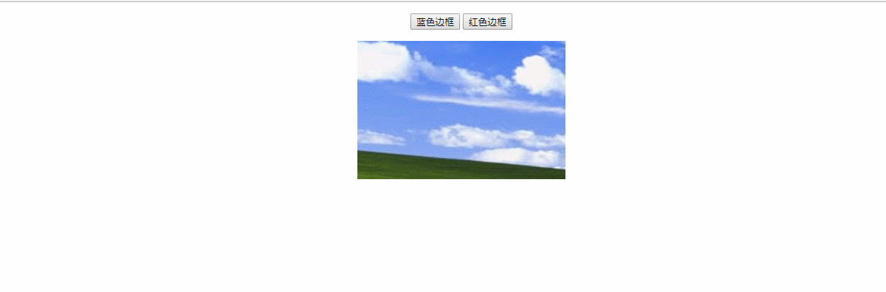

### 为图片加上边框
### 实例描述
在一些图片网站里,为了凸显一些图片比较特别,或推荐某某图集,通常会把这个图片的缩略图加上边框,以引起用户的注意
### 实现代码
```
<!DOCTYPE html>
<html>
    <head>
        <title>为图片加上边框</title>
        <meta http-equiv="Content-Type" content="text/html; charset=UTF-8"/>
            
    </head>
    <body style="text-align:center">
        <p>
            <input type="button" value="蓝色边框" onclick="addBorder('blue');"/>
            <input type="button" value="红色边框" onclick="addBorder('red');"/>
        </p>
        
        <script type="text/javascript">     
            function addBorder(color){  
                var pics = document.getElementsByTagName('IMG');
                for(var i=0;i<pics.length;i++){
                    pics[i].style.border = '2px solid ' + color;
                }
            }
        </script>
    </body>
</html>
```
### 运行效果

### 具体分析
为图片加上边框,最简单的就是通过css来修改图片的样式,因此,在实例代码中可以看到,修改边框的函数接受一个颜色参数,这个颜色就是边框的颜色值

